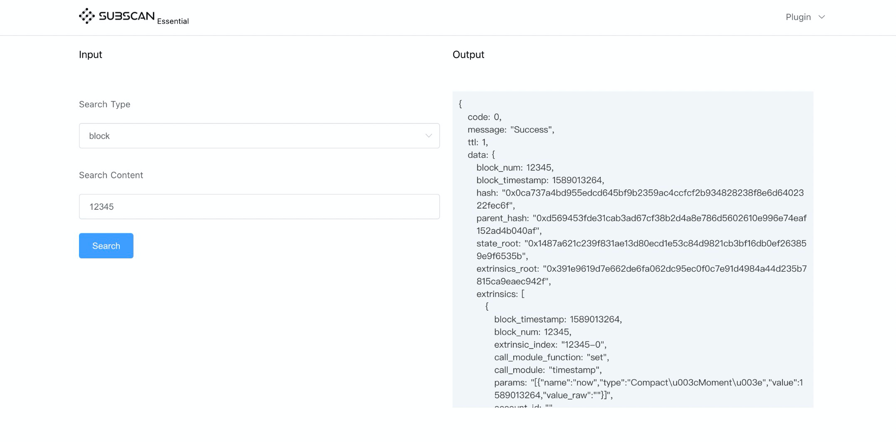

# Subscan Essentials


[](https://goreportcard.com/report/github.com/itering/subscan)


Subscan Essentials是一个高精度的区块链浏览器脚手架项目，它具有开发人员友好的界面和自定义模块解析功能，支持基于substrate的区块链网络。
它由Subscan团队开发，并在subscan.io中使用。开发人员可以自由使用代码库来扩展功能并为其受众开发独特的用户体验。


## Contents

- [Feature](#Feature)
- [QuickStart](#QuickStart)
  - [Requirement](#Requirement)
  - [Structure](docs/tree.md)
  - [Installation](#Install)
  - [UI](#UI)
  - [Usage](#Usage)
  - [Docker](#Docker)
  - [Test](#Test)
- [LICENSE](#LICENSE)
- [Resource](#Resource)


### Feature

1. 支持substrate 网络[自定义](/custom_type.md)type注册 
2. 支持索引block, Extrinsic, Event, log
3. 可自定义[插件](/plugins)索引更多的数据
4. [Gen](https://github.com/itering/subscan-plugin/tree/master/tool) 工具可自动生成插件模版
5. 内置默认的HTTP API [DOC](/docs/index.md)

## QuickStart

### Requirement

* Linux / Mac OSX
* Git
* Golang 1.12.4+
* Redis 3.0.4+
* MySQL 5.6+
* Node 8.9.0+

### Install

```bash
./build.sh build

//UI
cd ui && yarn && yarn dev
```

### UI

UI部分使用 [nuxt.js](https://nuxtjs.org/) 和 [amis](https://github.com/baidu/amis)

Demo: [blocks](/ui/plugins/blocks.js), 更多配置请参考 [amis docs](https://baidu.gitee.io/amis/docs/index)

[在线示例](https://crab.demo.subscan.io/)

在开发环境中请替换nuxt.config.js中的proxy target

```js
proxy: {
   "/api": {
      target: "https://your_server_name.com",
      secure: false,
      changeOrigin: true,
      pathRewrite: {
         "^/api": "/api"
      }
   },
}
```

在生产环境中请替换nuxt.config.js中的browserBaseURL

```js
axios: {
   proxy: process.env.NODE_ENV !== 'production',
    browserBaseURL: process.env.NODE_ENV !== 'production' ? "" : "https://your_server_name.com"
},
```



### Config

#### Init config file 

```bash
cp configs/redis.toml.example configs/redis.toml && cp configs/mysql.toml.example configs/mysql.toml && cp configs/http.toml.example configs/http.toml
```

#### Set

1. Redis  configs/redis.toml

> addr： redis host and port (default: 127.0.0.1:6379)

2. Mysql  configs/mysql.toml

> host: mysql host (default: 127.0.0.1)
> user: mysql user (default: root)
> pass: mysql user passwd (default: "")
> db:   mysql db name (default: "subscan")

3. Http   configs/http.toml

> addr: local http server port (default: 0.0.0.0:4399)


### Usage

- Start DB

**Make sure you have started redis and mysql**


- Substrate Daemon
```bash
cd cmd
./subscan start substrate
```

- Api Server
```bash
cd cmd
./subscan
```

- Help

```
NAME:
   SubScan - SubScan Backend Service, use -h get help

USAGE:
   main [global options] command [command options] [arguments...]

VERSION:
   1.0

DESCRIPTION:
   SubScan Backend Service, substrate blockchain explorer

COMMANDS:
     start    Start one worker, E.g substrate
     stop     Stop one worker, E.g substrate
     install  Create database and create default conf file
     help, h  Shows a list of commands or help for one command

GLOBAL OPTIONS:
   --conf value   (default: "../configs")
   --help, -h     show help
   --version, -v  print the version


```


### Docker

创建本地docker网络

```
docker network create app_net
```

启动mysql和redis的 container

```bash
docker-compose -f docker-compose.db.yml up  -d
```

启动subscan服务

```bash
docker-compose build
docker-compose up -d
```

### Test

```bash
go test ./...

//UI
cd ui && yarn && yarn test
```


## LICENSE

GPL-3.0


## Resource
 
- [ITERING] https://github.com/itering
- [Darwinia] https://github.com/darwinia-network/darwinia