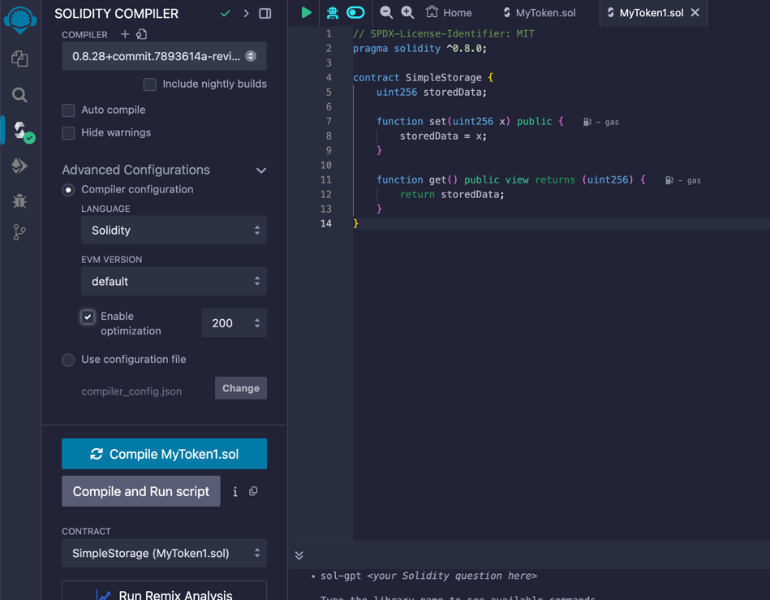

# Tutorial: Deploy and Verify Smart Contract using Remix & subscan

## Prerequisites
1. Install [MetaMask](https://metamask.io/)
2. Have test WND (can get from [Faucet](https://faucet.polkadot.io/westend))

---

## Step 1: Write Your Smart Contract
1. Open [Remix IDE](https://remix.polkadot.io/)
2. Create new file: `File Explorer` → `contracts` folder → New File (`YourContract.sol`)

Example contract:
```solidity
// SPDX-License-Identifier: MIT
pragma solidity ^0.8.0;

contract SimpleStorage {
    uint256 storedData;

    function set(uint256 x) public {
        storedData = x;
    }

    function get() public view returns (uint256) {
        return storedData;
    }
}
```

---

## Step 2: Compile Contract
1. Go to `Solidity Compiler` tab
2. Select correct compiler version
3. Check "Auto compile" and "Optimization" if needed
4. Click `Compile YourContract.sol`
5. Save `compilerInput` JSON file




---

## Step 3: Configure Deployment
1. Go to `Deploy & Run Transactions` tab
2. Environment: Select `Injected Provider - MetaMask`
3. Connect MetaMask when prompted
4. Confirm account has sufficient Token

---

## Step 4: Deploy Contract
1. Select contract from dropdown
2. Click `Deploy`
3. Confirm transaction in MetaMask
4. Wait for transaction confirmation
5. Copy deployed contract address from console

---

## Step 5: Verify on Subscan
1. Go to [Subscan](https://assethub-westend.subscan.io/verify_contract) (or other network explorer)
2. Fill verification form:
    - Compiler Type: `Solidity (Standard-Json-Input)`
    - Compiler Version: Match solidity compiler version
    - Upload remix `compilerInput` JSON file
    - Select `Resolc Version` (e.g., ` v0.1.0-dev.12`)
3. Click `Verify & Publish`

---

## Step 6: Confirm Verification
1. Wait for Subscan processing
2. Check contract page for "Verified" status
3. Green checkmark indicates successful verification
4. Source code will be visible on Subscan

---

## Important Notes

1. Use same compiler version for deployment and verification

---
